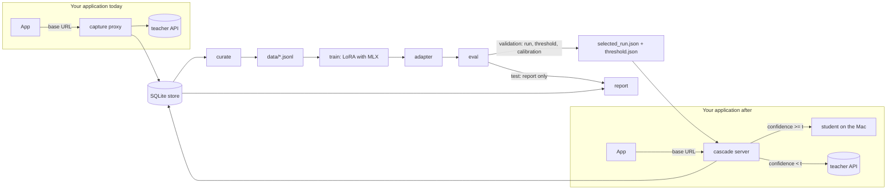

# taskdistill

**Replace an expensive LLM API call on a narrow task with a small fine-tuned model on your Mac, and prove it with
numbers.** taskdistill captures the traffic your application already sends, curates it into training data, LoRA
fine-tunes a 0.5B–1.5B Qwen2.5 student with MLX on Apple Silicon, evaluates it against the original model on held-out
data, and serves an OpenAI-compatible cascade: the student answers first and hands the request to the original model
(the teacher) when its calibrated confidence is below a threshold chosen on validation data. Your application changes
only its base URL.


## Why

Many production LLM calls are narrow: route a support message to one of N intents, pull eight fields out of an invoice
e-mail. They ship on a mid-tier API model because that is the fastest way to launch. At volume the call becomes a steady
cost and a latency floor (in this project the teacher answered in <!-- sync:teacher-latency -->…<!-- /sync -->), and it
sends every input to a third party. A small fine-tuned model could take most of that traffic, but teams hold back for
three reasons: nobody has the logged data in trainable shape, nobody trusts the small model's quality, and nobody knows
which requests it will get wrong.

taskdistill is for the engineers who own such a call. It gives you a reproducible way to

1. collect training data from the traffic you already have (a capture proxy, or an import of existing logs),
2. measure the student against the teacher on held-out data, with baselines and confidence intervals, and
3. run a cascade whose quality/cost trade-off you pick explicitly, on validation data, instead of hoping for it.

### How it relates to other tools

| Project | What it does | What it does not do here |
|---|---|---|
| [OpenPipe](https://openpipe.ai) | Hosted fine-tuning of smaller models from logged requests; acquired by CoreWeave in 2025, its platform stopped new training and inference on 30 July 2026 and moved to Weights & Biases. | Not local; its open-source repository has been paused since 2024. |
| [Predibase](https://www.rubrik.com/company/newsroom/press-releases/25/rubrik-to-acquire-predibase-to-accelerate-agentic-ai-adoption) / [LoRAX](https://github.com/predibase/lorax) | Managed fine-tuning and serving (Predibase, acquired by Rubrik in 2025); LoRAX serves many LoRA adapters on one NVIDIA GPU. | LoRAX serves only; it needs an NVIDIA GPU on Linux and does not capture, train or evaluate. |
| [RouteLLM](https://github.com/lm-sys/RouteLLM) | Routers that send each query to a strong or a weak existing general-purpose model. | It does not train a task-specific student from your traffic. |
| [FrugalGPT](https://arxiv.org/abs/2305.05176) | Research method and code for a cascade over a sequence of paid LLM APIs. | It cascades between existing API models; no local student, no capture proxy. |
| [distilabel](https://github.com/argilla-io/distilabel) | Pipelines that generate synthetic data and AI feedback and emit datasets. | It neither trains nor serves models. |
| [LiteLLM](https://github.com/BerriAI/litellm) | Gateway exposing 100+ LLM APIs in the OpenAI format, with routing, cost tracking and logging; fine-tuning passes through to hosted APIs. | It does not build training sets from its logs or distil locally. |

The gap taskdistill fills: one local, open-source pipeline from captured traffic to a calibrated cascade on Apple
Silicon, with an evaluation report you can reproduce offline. (Statements checked against each project's own site or
repository on 2026-09-26.)

## Quickstart

On an Apple Silicon Mac (macOS 14 or later) with [uv](https://docs.astral.sh/uv/getting-started/installation/)
installed. No API key is needed: without one, the demo replays the recorded teacher outputs that ship with the
package.

```bash
uvx --from git+https://github.com/B0yko/taskdistill taskdistill demo banking77
```

<!-- sync:quickstart-timing -->
<!-- /sync:quickstart-timing -->

The demo runs the whole pipeline on [Banking77](#data-and-licences) and leaves a trained student, a report in
`reports/banking77/` and a `request.json` in the current directory. Serve the cascade and call it:

```bash
uvx --from git+https://github.com/B0yko/taskdistill taskdistill serve --task banking77
```

```bash
curl -s -D - http://127.0.0.1:8000/v1/chat/completions -H 'Content-Type: application/json' -d @request.json
```

The response is a standard `chat.completion`; the `x-taskdistill-route` header says whether the student or the teacher
answered and `x-taskdistill-confidence` carries the student's confidence. `taskdistill demo invoices` does the same for
JSON extraction on synthetic invoices. Use `--profile full` for the configuration behind the numbers below (it takes
tens of minutes to hours on a laptop).

## How it works



| Step | Command | What it does |
|---|---|---|
| Capture | `taskdistill capture --task T` | OpenAI-compatible reverse proxy: forwards `POST /chat/completions` unchanged with the client's own `Authorization`, and stores request and response bodies, usage, latency and status. It never stores a header. `--import` loads existing logs instead. |
| Curate | `taskdistill curate --task T` | Extracts the task input, merges records by input hash (this is how gold labels reach captured inputs), normalises teacher outputs, scrubs PII, assigns splits, removes duplicates and near-duplicates inside and across splits, labels unlabelled inputs with the teacher, drops (never truncates) over-long examples, and fails unless an independent leakage check finds zero duplicates across splits. |
| Train | `taskdistill train --task T` | LoRA on the 4-bit base with mlx-lm, loss on completion tokens only, keeping the checkpoint with the best validation loss. `--backend torch` uses transformers + PEFT instead. |
| Eval | `taskdistill eval --task T --select` | Chooses the run and the cascade threshold on validation, then scores student, teacher, cascade and baselines on test with paired bootstrap confidence intervals and calibration metrics. |
| Serve | `taskdistill serve --task T` | FastAPI server with `/v1/chat/completions`, `/v1/models`, `/healthz` and `/metrics`. Low-confidence, unsupported and unparsable requests go to the teacher with the teacher's key, never the client's. |
| Report | `taskdistill report --task T` | Quality, operating point, $/1k requests, latency and break-even volume, optionally from real served traffic (`--from-serve-log`). |

**Confidence.** Classification decodes greedily under a trie of the canonical labels, so every answer is a valid
label; confidence is the product of the renormalised probabilities of the chosen tokens (the end token included, so a
label that is a prefix of another is handled). Extraction generates JSON freely; each field's confidence is the
product of the probabilities of the tokens spanning its value, and the document's confidence is the minimum over
fields (0 for invalid JSON or a schema violation).

**Selection on validation only.** Every choice (base model, seed, checkpoint, threshold, isotonic calibration,
baseline hyperparameters) is made by a function that accepts only a `ValidationSplit`; passing a `TestSplit` raises
`TypeError`. The threshold is the one with the lowest escalation rate that meets the target on validation, and the
test split then reports whether the target held.

## Use it on your own call

Say your application classifies support tickets with a paid API model.

1. **Create a task spec.**

   ```bash
   uvx --from git+https://github.com/B0yko/taskdistill taskdistill init tickets --type classification
   ```

   Edit `tasks/tickets/teacher_prompt.md` (the system prompt your application sends today), `labels.txt`, and in
   `task.yaml` the teacher's `model`, `base_url` and, for OpenRouter, the pinned provider in `extra_body`.
   Everything below runs in the directory that contains `tasks/`; the workspace defaults to `./.taskdistill`.

2. **Capture traffic.** Start the proxy and change only the base URL of your OpenAI client:

   ```bash
   export TASKDISTILL_TEACHER_BASE_URL=https://openrouter.ai/api/v1   # where the proxy forwards
   uvx --from git+https://github.com/B0yko/taskdistill taskdistill capture --task tickets
   ```

   ```python
   from openai import OpenAI

   client = OpenAI(base_url="http://127.0.0.1:8787/t/tickets/v1", api_key=YOUR_KEY)  # the key is passed through
   ```

   Or import logs you already have (`--format openai` for request/response pairs, `pairs` for input/output,
   `inputs` for unlabelled inputs that the teacher will label). Gold labels, if you have any, are imported with
   `--format inputs` and joined to captured traffic by input hash:

   ```bash
   taskdistill capture --task tickets --import gold.jsonl --format inputs
   ```

3. **Curate, train and evaluate.** Curate prints a projected cost from a 50-request sample before labelling anything
   and asks for `--yes` above $0.50; `--max-usd` caps the run.

   ```bash
   export TASKDISTILL_TEACHER_API_KEY=...    # or OPENROUTER_API_KEY
   taskdistill curate --task tickets --max-usd 2
   taskdistill train --task tickets
   taskdistill eval --task tickets --select
   ```

   Without gold labels, eval reports agreement with the teacher, and the default cascade target (97% agreement) needs
   no gold at all.

4. **Serve the cascade** and point your client at it. The model string your application sends can stay as it is.

   ```bash
   taskdistill serve --task tickets
   ```

   ```python
   client = OpenAI(base_url="http://127.0.0.1:8000/v1", api_key="unused")
   ```

5. **Watch it.** `taskdistill report --task tickets --from-serve-log --since 24h` recomputes the figures from real
   served traffic, including the observed escalation rate; a rate far above the validation estimate means the traffic
   has drifted away from the training data.

<!-- sync:results -->
<!-- /sync:results -->

## Configuration reference

A task lives in `tasks/<task>/task.yaml` next to its teacher prompt and its labels file or JSON Schema. String values
can use `${NAME}` or `${NAME:-default}` environment references. Unknown keys are errors, and every validation error
names the offending key.

| Key | Default | Meaning |
|---|---|---|
| `task` | (required) | Task name: 1–64 letters, digits, `.`, `_` or `-`. Data lives in `$TASKDISTILL_HOME/<task>/`. |
| `type` | (required) | `classification` or `extraction`. |
| `labels_file` | — | Classification: one canonical label per line (required). |
| `schema_file` | — | Extraction: a JSON Schema with `type: object` and `properties` (required). |
| `input.from` | `last_user_message` | Where the task input is in each request: the last user message, or `regex`. |
| `input.regex` | `null` | With `from: regex`: a pattern over the last user message with a named group `input`. Requests that do not match go to the teacher (`input_unparsed`). |
| `teacher.base_url` | `https://openrouter.ai/api/v1` | Any OpenAI-compatible endpoint. |
| `teacher.api_key_env` | `TASKDISTILL_TEACHER_API_KEY` | Environment variable holding the teacher key; falls back to `OPENROUTER_API_KEY`. |
| `teacher.model` | (required) | The slug your application calls today. |
| `teacher.prompt_file` | `teacher_prompt.md` | The teacher's system prompt, sent verbatim. |
| `teacher.temperature` | `0` | Teacher sampling temperature. |
| `teacher.max_tokens` | `256` | Teacher completion cap; outputs that hit it are flagged as truncated. |
| `teacher.response_format` | `null` | For example `{type: json_object}`, when the provider supports it. |
| `teacher.extra_body` | `{}` | Extra request fields: provider pinning (`provider: {order: [...], allow_fallbacks: false}`), reasoning controls. Recorded in the replay manifest, not in the request key. |
| `student.base_model` | `mlx-community/Qwen2.5-0.5B-Instruct-4bit` | Hugging Face id or local directory of the student base; `--base` overrides it. |
| `student.system_prompt` | (required) | The student's short system prompt, used in training and serving. |
| `student.max_tokens` | `16` | Student generation cap. |
| `student.response_template` | `null` | Renders student answers and canonical escalations, e.g. `'{"intent": "{label}"}'` (literal replacement of `{label}`). |
| `train.profile` | `full` | `quick` caps training at 200 iterations and validates less often; `--profile` overrides it. |
| `train.lora_rank` | `16` | LoRA rank (scale 20, as mlx-lm's default). |
| `train.lora_layers` | `all` | Number of top transformer blocks to adapt, or `all`. |
| `train.learning_rate` | `1.0e-4` | Peak learning rate (Adam). |
| `train.batch_size` | `8` | Examples per step. |
| `train.epochs` | `2` | Passes over the training split. |
| `train.max_seq_len` | `512` | Longer examples are dropped by curate and training, never truncated. |
| `train.seed` | `13` | Training seed (`--seed` overrides it). |
| `train.lr_schedule` | `warmup_cosine` | Linear warm-up over 10% of the iterations (at most 100), then cosine decay to 10% of the peak; or `constant`. |
| `curate.dedupe.exact` | `true` | Exact duplicates on the normalised input (NFKC, whitespace-collapsed, case-folded). |
| `curate.dedupe.near_dup_jaccard` | `0.9` | MinHash LSH threshold on word 3-shingles (0.5–1). Inputs under 3 words are compared exactly. |
| `curate.pii.enabled` | `true` | Regex scrub with checksums before dedupe; matches become `<EMAIL>`, `<PHONE>`, `<IBAN>`, `<CARD>`, `<IPV4>`, `<SSN>`. |
| `curate.pii.kinds` | all six | Any subset of `email, phone, iban, card, ipv4, ssn`. |
| `curate.split.predefined` | `meta.split` | Meta field whose value (`train`, `valid`, `test`) fixes a row's split; `null` to ignore. |
| `curate.split.val`, `curate.split.test` | `0.1`, `0.1` | Fractions for rows without a predefined split. |
| `curate.split.stratify` | `true` | Stratify the random split by label (classification). |
| `curate.split.group_by` | `null` | Meta field whose groups stay in one split (for example `meta.template`); also the clusters of the cluster bootstrap. Without it, eval uses `meta.group` when present. |
| `curate.split.seed` | `13` | Split seed. |
| `cascade.reference` | `teacher` | What the target is measured against: `teacher` (works with no gold labels) or `gold`. |
| `cascade.metric` | `agreement` | `agreement` (label equality, or field micro-F1 against the teacher for extraction), `accuracy` or `macro_f1` (classification), `field_f1` (extraction). |
| `cascade.target` | — | Minimum cascade quality on validation, e.g. `0.97`. Set exactly one of `target` and `max_drop`. |
| `cascade.max_drop` | — | Maximum drop below the teacher's own score on the reference, usually with `reference: gold`. |
| `cascade.on_teacher_error` | `student` | On a teacher timeout or error: return the student's answer (`student-fallback`) or an HTTP 502 (`error`). A replay miss is always an error. `serve`'s escalation gives up quickly rather than retrying like a batch job: a 10 s HTTP timeout, at most 1 retry, `Retry-After` honoured up to 2 s, all within a 30 s deadline for the whole call (wait for a free connection included), so a hung or rate-limited teacher falls back within seconds, not minutes. |
| `cascade.escalation_response` | `canonical` | `canonical` normalises and renders the teacher's answer like a student answer; `raw` returns it verbatim. |
| `cost.local_watts` | `20` | Power draw assumed for local inference and training. |
| `cost.usd_per_kwh` | `0.30` | Electricity price. |
| `cost.hardware_usd`, `cost.amortisation_hours` | `0`, `0` | Hardware amortisation, applied only when both are above 0. |
| `budget.usd_cap` | `null` | Optional per-task spend cap; `TASKDISTILL_BUDGET_USD` always applies. |

**Environment** (see `.env.example`): `TASKDISTILL_TEACHER_BASE_URL`, `TASKDISTILL_TEACHER_API_KEY` (falls back to
`OPENROUTER_API_KEY`), `TASKDISTILL_TEACHER_MODEL`, `TASKDISTILL_BUDGET_USD` (global spend cap, default 5.00),
`TASKDISTILL_SERVER_TOKEN` (required to bind `capture` or `serve` beyond localhost) and `TASKDISTILL_HOME` (the
workspace: store, response cache, ledger, curated data and runs; default `./.taskdistill`).

**Spend control.** Every command that can call the teacher takes `--max-usd` (a cap for that run) and `--yes`. Before
each call the ledger reserves the worst case (UTF-8 bytes of the messages plus 16 per message as prompt tokens, plus
`max_tokens` of completion) and settles it with the `usage.cost` the API returns, so concurrent calls can never cross a
cap. Batches first run a 50-request sample and need `--yes` when the projection exceeds $0.50. `taskdistill budget`
prints the spend by task and phase.

## Limitations

- **Platforms.** The MLX path needs Apple Silicon and macOS 14 or later (the minimum of the pinned `mlx` wheels). On
  other machines `train --backend mlx` stops with a message pointing to `--backend torch`. The torch path
  (transformers + PEFT, Unsloth when importable with CUDA) is tested on CPU with a tiny model in CI; **it has not been
  run on a GPU**, and the Unsloth branch is covered only by a dispatch test with a mock.
- **PII scrub is best-effort.** It is a regex scrub with checksums for e-mail addresses, phone numbers, IBANs, card
  numbers, IPv4 addresses and US SSNs. It does not find names, street addresses or anything else, and it is not an
  anonymisation guarantee. It also creates a train/serve skew: the student trains on placeholders such as `<EMAIL>`
  but sees raw text when it serves.
- **Training on Metal is not bit-for-bit deterministic.** Two runs with the same seed can differ slightly; the
  results report the spread over seeds and the tolerance used when checking that README numbers reproduce.
- **Scope.** Single-turn classification and JSON extraction only: no summaries or chat replies, no multi-turn or
  tool-calling tasks, no multi-label classification. Streamed responses are forwarded but not captured. The server
  generates one request at a time (no batching) and serves one task per process. Escalations for unsupported or
  unparsable requests are returned verbatim; only low-confidence escalations are normalised.
- **Evaluation limits.** The invoice test set is 600 documents from 6 layouts never seen in training, so its effective
  sample is 6 layouts; the template-cluster bootstrap intervals say how wide that makes the uncertainty. The invoices
  are synthetic and cleaner than real mail. Banking77's gold labels are noisy (Ying and Thomas, 2022, flag about 14%
  of the training utterances as potential label errors), which caps any model's measured accuracy against gold.
- **Cost figures are estimates where they are not measured.** Local cost is an energy estimate (20 W at $0.30/kWh by
  default, both configurable), not a power measurement. With an inexpensive teacher whose provider caches the shared
  prompt, the money saved per request is small; the main gains are latency and keeping inputs on the machine.
- **Latency numbers are dated measurements** on a fanless MacBook Air that throttles under sustained load and shares
  the machine with other work; the load average is recorded next to every timing, and live numbers are not expected
  to reproduce exactly.
- **Adapters are merged into the 4-bit base in memory** for evaluation and serving (about 1.7 times faster). The
  re-quantisation shifts confidences slightly, which is why the threshold is chosen on the same merged model that
  serves.
- **Teacher terms.** Some commercial APIs forbid using their outputs to train other models. Check your provider's terms
  before distilling its outputs; see [ADR 5](docs/adr/0005-teacher-model-choice.md) for the checks made here.

## Roadmap

- Shadow mode and canary routing for the cascade, so a new student can be compared on live traffic before it answers.
- Scheduled retraining and active learning from escalated requests (the served log already records them).
- Drift alerts on the observed escalation rate (today `report --from-serve-log` shows drift; nothing alerts).
- Capture of streamed responses, multi-turn and tool-calling tasks.
- Constrained JSON decoding for extraction, and request batching in the server.

## Data and licences

- **taskdistill** is Apache-2.0 (Copyright 2026 Andrii Boiko). The synthetic invoice generator and its output are part
  of the repository and share that licence.
- **Banking77** (Casanueva et al., 2020) is licensed under
  [CC BY 4.0](https://creativecommons.org/licenses/by/4.0/). The demo downloads the CSVs at runtime from a pinned
  commit of [PolyAI-LDN/task-specific-datasets](https://github.com/PolyAI-LDN/task-specific-datasets/tree/57ec275d8078af65b7731c2a98be812d844a6d6b/banking_data)
  and checks their SHA-256. If GitHub is unavailable it falls back to the Parquet mirror `legacy-datasets/banking77`
  on the Hugging Face Hub (install the `hub` extra); `PolyAI/banking77` itself is a script-based Hub repository with no
  Parquet conversion. This repository does not redistribute the CSVs: it ships only the teacher's outputs keyed by
  request hash. Modifications: the official training set is split 90/10 into train and validation (stratified, seed
  13), and duplicates are removed as described above.

  ```bibtex
  @inproceedings{casanueva-etal-2020-efficient,
      title = "Efficient Intent Detection with Dual Sentence Encoders",
      author = "Casanueva, I{\~n}igo and Tem{\v{c}}inas, Tadas and Gerz, Daniela and Henderson, Matthew and Vuli{\'c}, Ivan",
      booktitle = "Proceedings of the 2nd Workshop on Natural Language Processing for Conversational AI",
      year = "2020",
      publisher = "Association for Computational Linguistics",
      url = "https://aclanthology.org/2020.nlp4convai-1.5/",
      doi = "10.18653/v1/2020.nlp4convai-1.5",
      pages = "38--45"
  }
  ```
- **Student bases**: [Qwen2.5-0.5B-Instruct](https://huggingface.co/Qwen/Qwen2.5-0.5B-Instruct) and
  [Qwen2.5-1.5B-Instruct](https://huggingface.co/Qwen/Qwen2.5-1.5B-Instruct) are Apache-2.0; the demos use the 4-bit MLX
  conversions `mlx-community/Qwen2.5-0.5B-Instruct-4bit` and `mlx-community/Qwen2.5-1.5B-Instruct-4bit` at pinned
  revisions. No trained adapters are published.
- **Teacher outputs**: DeepSeek V4.1 Flash (Banking77) and DeepSeek V4 Flash 0731 (invoices) through OpenRouter, pinned
  to the DeepInfra provider. The DeepSeek V4 weights are MIT-licensed, DeepSeek's platform terms allow training other
  models on outputs, and DeepInfra's terms do not restrict the use of outputs
  ([ADR 5](docs/adr/0005-teacher-model-choice.md)). The outputs were recorded on 2026-09-26.

## Licence

Apache-2.0. See [LICENSE](LICENSE). Copyright 2026 Andrii Boiko.
