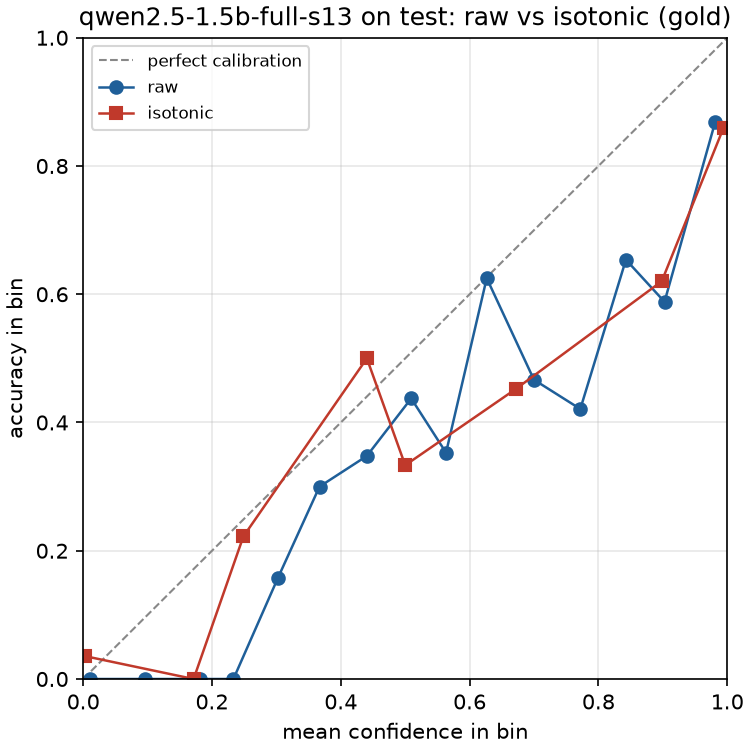

# taskdistill report: invoices

- Report built: 2026-09-27T01:05:51+00:00 on Mac17,4, Apple M5, 24 GB, macOS 26.6.2
- Command: `taskdistill report --task invoices --out reports/invoices`
- Each measured number carries the date and hardware of the evaluation or bench that produced it.
- Teacher: `deepseek/deepseek-v4-flash-0731` via deepinfra/fp8
- Selected run: `qwen2.5-1.5b-full-s13` (qwen2.5-1.5b-full-s13: best validation agreement (0.9854) among 1 run(s) of mlx-community/Qwen2.5-1.5B-Instruct-4bit; mlx-community/Qwen2.5-1.5B-Instruct-4bit vs mlx-community/Qwen2.5-0.5B-Instruct-4bit: large gains 3.79 points (>= 1.00) at 1.79x the small p95 (< 3x))

## Quality (test split, n = 600)

Cells are the score and its 95% paired bootstrap interval (1,000 resamples). Rows over several seeds show mean ± sample standard deviation; their interval is that of the validation-selected seed. Teacher and cascade numbers come from recorded teacher outputs. ECE and AUROC use raw student confidence.

| System | n | JSON validity | Field micro-F1 | Field EM | Doc EM | Agreement | ECE | AUROC | Runs |
|---|---|---|---|---|---|---|---|---|---|
| teacher (deepseek/deepseek-v4-flash-0731) | 600 | 100.0% [100.0, 100.0] | 99.5% [99.3, 99.7] | 99.5% [99.3, 99.7] | 96.0% [94.5, 97.5] | reference | — | — | `qwen2.5-1.5b-full-s13` |
| zero-shot qwen2.5-0.5b | 600 | 42.3% [38.7, 46.2] | 37.0% [34.3, 40.0] | 24.8% [22.5, 27.4] | 1.8% [0.8, 3.0] | 36.9% [34.1, 39.9] | 15.9% [14.2, 17.8] | 0.770 [0.717, 0.824] | `zero-shot-qwen2.5-0.5b` |
| zero-shot qwen2.5-1.5b | 600 | 62.3% [58.2, 66.2] | 73.3% [70.2, 76.1] | 58.9% [54.9, 62.6] | 40.3% [36.3, 44.3] | 73.3% [70.2, 76.1] | 9.7% [8.2, 11.5] | 0.981 [0.970, 0.989] | `zero-shot-qwen2.5-1.5b` |
| student qwen2.5-0.5b (teacher labels, 3 seeds) | 600 | 97.1% ± 4.3 [100.0, 100.0] | 87.2% ± 4.4 [89.9, 91.8] | 85.9% ± 4.7 [90.4, 92.2] | 39.2% ± 21.2 [51.3, 59.3] | 86.8% ± 4.5 [89.3, 91.4] | 15.6% ± 13.3 [6.7, 11.8] | 0.874 ± 0.113 [0.888, 0.935] | `qwen2.5-0.5b-full-s13`, `qwen2.5-0.5b-full-s14`, `qwen2.5-0.5b-full-s15` |
| student qwen2.5-1.5b (teacher labels) | 600 | 99.2% [98.3, 99.8] | 94.1% [93.3, 94.9] | 94.0% [93.0, 94.9] | 67.5% [63.8, 71.3] | 93.5% [92.6, 94.4] | 14.1% [11.9, 17.6] | 0.846 [0.813, 0.879] | `qwen2.5-1.5b-full-s13` |
| student qwen2.5-1.5b (gold labels) | 600 | 95.0% [93.0, 96.7] | 93.8% [92.5, 94.9] | 91.4% [89.3, 93.1] | 78.2% [74.8, 81.5] | 93.5% [92.1, 94.6] | 7.8% [5.8, 10.6] | 0.902 [0.869, 0.931] | `qwen2.5-1.5b-full-s13-gold` |
| cascade (qwen2.5-1.5b-full-s13, t = 0.1524) | 600 | 100.0% [100.0, 100.0] | 94.6% [93.9, 95.3] | 94.9% [94.3, 95.6] | 69.2% [65.3, 72.8] | 94.1% [93.3, 94.9] | — | — | `qwen2.5-1.5b-full-s13` |

Cluster bootstrap over 6 groups (templates): 95% intervals.

| System | JSON validity | Field micro-F1 | Field EM | Doc EM | Agreement | ECE | AUROC |
|---|---|---|---|---|---|---|---|
| teacher (deepseek/deepseek-v4-flash-0731) | [100.0, 100.0] | [98.4, 100.0] | [98.5, 100.0] | [88.0, 100.0] | [100.0, 100.0] | — | — |
| zero-shot qwen2.5-0.5b | [29.0, 55.7] | [23.9, 50.3] | [15.4, 36.0] | [0.0, 5.2] | [23.5, 50.3] | [11.1, 21.3] | [0.662, 0.916] |
| zero-shot qwen2.5-1.5b | [32.6, 86.8] | [46.7, 89.1] | [30.4, 82.3] | [19.7, 58.8] | [46.7, 89.1] | [5.0, 14.5] | [0.967, 0.993] |
| student qwen2.5-0.5b (teacher labels, 3 seeds) | [100.0, 100.0] | [82.3, 96.3] | [83.2, 96.4] | [30.7, 73.3] | [80.8, 96.3] | [5.0, 19.5] | [0.873, 0.943] |
| student qwen2.5-1.5b (teacher labels) | [97.8, 100.0] | [87.1, 98.5] | [86.9, 98.4] | [38.7, 89.3] | [85.5, 98.5] | [4.2, 41.6] | [0.696, 0.977] |
| student qwen2.5-1.5b (gold labels) | [87.3, 99.0] | [83.2, 98.8] | [77.8, 98.3] | [47.0, 94.7] | [82.1, 98.8] | [4.1, 28.7] | [0.871, 0.991] |
| cascade (qwen2.5-1.5b-full-s13, t = 0.1524) | [100.0, 100.0] | [88.3, 98.7] | [89.1, 98.7] | [41.0, 89.8] | [86.7, 98.7] | — | — |

Per-seed values, student qwen2.5-0.5b (teacher labels, 3 seeds) (selected: `qwen2.5-0.5b-full-s13`):

| Run | Seed | JSON validity | Field micro-F1 | Field EM | Doc EM | Agreement | ECE | AUROC |
|---|---|---|---|---|---|---|---|---|
| `qwen2.5-0.5b-full-s13` | 13 | 100.0% | 90.9% | 91.3% | 55.3% | 90.4% | 8.4% | 0.913 |
| `qwen2.5-0.5b-full-s14` | 14 | 92.2% | 88.5% | 84.2% | 47.2% | 88.3% | 7.3% | 0.962 |
| `qwen2.5-0.5b-full-s15` | 15 | 99.2% | 82.3% | 82.3% | 15.2% | 81.8% | 31.0% | 0.747 |

Per-group (template) scores

student:

| Group | n | JSON validity | Field micro-F1 | Field EM | Doc EM | Agreement |
|---|---|---|---|---|---|---|
| email-13 | 100 | 100.0% | 99.2% | 99.2% | 94.0% | 99.2% |
| email-14 | 100 | 100.0% | 95.9% | 96.1% | 69.0% | 95.9% |
| email-15 | 100 | 100.0% | 98.8% | 98.9% | 91.0% | 98.8% |
| layout-13 | 100 | 99.0% | 98.8% | 98.4% | 94.0% | 98.8% |
| layout-14 | 100 | 96.0% | 77.1% | 76.9% | 0.0% | 73.8% |
| layout-15 | 100 | 100.0% | 94.2% | 94.5% | 57.0% | 94.2% |

teacher:

| Group | n | Field micro-F1 | Field EM | Doc EM |
|---|---|---|---|---|
| email-13 | 100 | 100.0% | 100.0% | 100.0% |
| email-14 | 100 | 100.0% | 100.0% | 100.0% |
| email-15 | 100 | 100.0% | 100.0% | 100.0% |
| layout-13 | 100 | 100.0% | 100.0% | 100.0% |
| layout-14 | 100 | 96.8% | 97.0% | 76.0% |
| layout-15 | 100 | 100.0% | 100.0% | 100.0% |

cascade:

| Group | n | JSON validity | Field micro-F1 | Field EM | Doc EM | Agreement |
|---|---|---|---|---|---|---|
| email-13 | 100 | 100.0% | 99.2% | 99.2% | 94.0% | 99.2% |
| email-14 | 100 | 100.0% | 96.0% | 96.2% | 70.0% | 96.0% |
| email-15 | 100 | 100.0% | 98.8% | 98.9% | 91.0% | 98.8% |
| layout-13 | 100 | 100.0% | 99.3% | 99.4% | 95.0% | 99.3% |
| layout-14 | 100 | 100.0% | 79.5% | 80.9% | 4.0% | 76.2% |
| layout-15 | 100 | 100.0% | 94.7% | 95.0% | 61.0% | 94.7% |

Per-field exact match

Against the gold:

| Field | student | teacher | cascade |
|---|---|---|---|
| `vendor_name` | 88.7% | 96.0% | 90.2% |
| `invoice_number` | 83.0% | 100.0% | 83.8% |
| `invoice_date` | 94.8% | 100.0% | 95.7% |
| `due_date` | 88.8% | 100.0% | 89.8% |
| `currency` | 99.2% | 100.0% | 100.0% |
| `total_amount` | 99.2% | 100.0% | 100.0% |
| `tax_amount` | 99.2% | 100.0% | 100.0% |
| `po_number` | 99.2% | 100.0% | 100.0% |

Against the teacher:

| Field | student | cascade |
|---|---|---|
| `vendor_name` | 84.7% | 86.2% |
| `invoice_number` | 83.0% | 83.8% |
| `invoice_date` | 94.8% | 95.7% |
| `due_date` | 88.8% | 89.8% |
| `currency` | 99.2% | 100.0% |
| `total_amount` | 99.2% | 100.0% |
| `tax_amount` | 99.2% | 100.0% |
| `po_number` | 99.2% | 100.0% |

Per-trait breakdown

student:

| Trait | n | JSON validity | Field micro-F1 | Field EM | Doc EM | Agreement |
|---|---|---|---|---|---|---|
| (none) | 91 | 98.9% | 94.3% | 93.8% | 70.3% | 93.4% |
| distractor_amounts | 306 | 99.0% | 93.9% | 93.8% | 67.6% | 93.4% |
| eu_number_format | 156 | 98.7% | 95.0% | 94.7% | 73.1% | 94.7% |
| label_typos | 59 | 98.3% | 94.5% | 93.6% | 71.2% | 94.3% |
| missing_optional | 177 | 99.4% | 92.5% | 93.6% | 63.3% | 91.8% |
| net_terms_due | 93 | 97.8% | 87.8% | 87.5% | 35.5% | 87.1% |
| quoted_reply_chain | 126 | 100.0% | 94.4% | 94.7% | 68.3% | 94.2% |

teacher:

| Trait | n | Field micro-F1 | Field EM | Doc EM |
|---|---|---|---|---|
| (none) | 91 | 99.0% | 99.0% | 92.3% |
| distractor_amounts | 306 | 99.6% | 99.6% | 96.7% |
| eu_number_format | 156 | 99.7% | 99.7% | 97.4% |
| label_typos | 59 | 99.8% | 99.8% | 98.3% |
| missing_optional | 177 | 99.4% | 99.5% | 96.0% |
| net_terms_due | 93 | 99.3% | 99.3% | 94.6% |
| quoted_reply_chain | 126 | 99.8% | 99.8% | 98.4% |

cascade:

| Trait | n | JSON validity | Field micro-F1 | Field EM | Doc EM | Agreement |
|---|---|---|---|---|---|---|
| (none) | 91 | 100.0% | 94.9% | 94.9% | 71.4% | 94.0% |
| distractor_amounts | 306 | 100.0% | 94.5% | 94.8% | 69.0% | 94.0% |
| eu_number_format | 156 | 100.0% | 95.8% | 96.1% | 75.0% | 95.5% |
| label_typos | 59 | 100.0% | 95.1% | 95.3% | 72.9% | 94.8% |
| missing_optional | 177 | 100.0% | 92.9% | 94.3% | 65.0% | 92.3% |
| net_terms_due | 93 | 100.0% | 89.6% | 90.2% | 41.9% | 88.9% |
| quoted_reply_chain | 126 | 100.0% | 94.4% | 94.7% | 68.3% | 94.2% |

Confidence definitions compared

| Split | Confidence | n | Mean confidence | AUROC vs teacher | AUROC vs gold | Accuracy vs teacher | Accuracy vs gold | ECE vs teacher | ECE vs gold |
|---|---|---|---|---|---|---|---|---|---|
| valid | primary (chosen) | 400 | 88.5% | 0.904 | 0.913 | 89.8% | 90.5% | 3.7% | 4.3% |
| valid | alternative | 400 | 99.8% | 0.903 | 0.908 | 89.8% | 90.5% | 10.0% | 9.3% |
| test | primary (chosen) | 600 | 81.6% | 0.846 | 0.846 | 67.5% | 67.5% | 14.1% | 14.1% |
| test | alternative | 600 | 99.6% | 0.858 | 0.858 | 67.5% | 67.5% | 32.1% | 32.1% |

Evaluation dates, hardware and commands

| Run | Date | Hardware | Command |
|---|---|---|---|
| `qwen2.5-1.5b-full-s13` | 2026-09-26T22:15:18+00:00 | Mac17,4, Apple M5, 24 GB, macOS 26.6.2 | `taskdistill eval --task invoices --run qwen2.5-1.5b-full-s13` |
| `zero-shot-qwen2.5-0.5b` | 2026-09-27T01:05:48+00:00 | Mac17,4, Apple M5, 24 GB, macOS 26.6.2 | `taskdistill eval --task invoices --zero-shot --base mlx-community/Qwen2.5-0.5B-Instruct-4bit` |
| `zero-shot-qwen2.5-1.5b` | 2026-09-27T00:48:31+00:00 | Mac17,4, Apple M5, 24 GB, macOS 26.6.2 | `taskdistill eval --task invoices --zero-shot` |
| `qwen2.5-0.5b-full-s13` | 2026-09-26T21:59:21+00:00 | Mac17,4, Apple M5, 24 GB, macOS 26.6.2 | `taskdistill eval --task invoices --run qwen2.5-0.5b-full-s13` |
| `qwen2.5-0.5b-full-s14` | 2026-09-26T22:07:08+00:00 | Mac17,4, Apple M5, 24 GB, macOS 26.6.2 | `taskdistill eval --task invoices --run qwen2.5-0.5b-full-s14` |
| `qwen2.5-0.5b-full-s15` | 2026-09-26T22:15:15+00:00 | Mac17,4, Apple M5, 24 GB, macOS 26.6.2 | `taskdistill eval --task invoices --run qwen2.5-0.5b-full-s15` |
| `qwen2.5-1.5b-full-s13-gold` | 2026-09-27T00:14:19+00:00 | Mac17,4, Apple M5, 24 GB, macOS 26.6.2 | `taskdistill eval --task invoices --run qwen2.5-1.5b-full-s13-gold` |

The test split has been scored 9 times in this workspace (`test_access_log.jsonl`), every time by an evaluation listed in the table above; nothing was chosen with it.

## Operating point

|  | Value |
|---|---|
| Selected run | `qwen2.5-1.5b-full-s13` |
| Target | Agreement ≥ 97.0% against the teacher |
| Chosen threshold (on validation) | 0.1524 |
| Escalation rate, validation / test | 0.0% / 1.7% |
| Cascade quality, validation / test | 98.5% / 94.1% |
| Cascade − teacher, Agreement against the teacher (target) | -5.9 pts [-6.7, -5.1], cluster [-13.3, -1.3] |
| Cascade − teacher, Field micro-F1 (gold) | -4.8 pts [-5.5, -4.2], cluster [-10.1, -1.3] |
| Target held on test | no |
| Evaluated | 2026-09-26T22:15:18+00:00 on Mac17,4, Apple M5, 24 GB, macOS 26.6.2, `taskdistill eval --task invoices --run qwen2.5-1.5b-full-s13` |

## Cost and latency

| System | $ / 1k requests | p50 ms | p95 ms | n | Source |
|---|---|---|---|---|---|
| Teacher only | $0.0462 | 1,354 | 2,427 | 600 | recorded live labelling calls, concurrency 8 |
| Student only | $0.00240 | 1,391 | 1,988 | 600 | eval (flagged) |
| Cascade | $0.00318 | 1,398 | 2,070 | 600 | composed per request, 1.7% escalated |

Assumptions: local cost = 20 W x wall time x $0.3/kWh; hardware amortisation off. Teacher cost is the mean recorded `usage.cost` of the test requests; teacher latency is the recorded latency of the live labelling calls (cache hits and retried attempts excluded), recorded on 2026-09-26.

Student latency: in-process generation latency from `taskdistill eval` (flagged: not end-to-end through `serve`; run `taskdistill bench` against `serve --threshold 0` for the measured figure). Measured 2026-09-26T22:15:18+00:00 on Mac17,4, Apple M5, 24 GB, macOS 26.6.2, `taskdistill eval --task invoices --run qwen2.5-1.5b-full-s13`.

Cascade latency is composed per test request as student latency plus the recorded teacher latency when the request escalates at the chosen threshold; cascade cost is the student energy plus the teacher cost of escalated requests.

At the list price without the provider's prompt cache (the same token counts), the teacher costs $0.0577 and the cascade $0.00337 per 1k requests.

## Break-even volume

**3,443 requests** = (labelling $0.138 (ledger) + training energy $0.00966) / savings $0.0000430 per request.
At the list price without prompt caching: 2,726 requests (savings $0.0000543 per request; labelling cost as paid).

Assumptions: local cost = 20 W x wall time x $0.3/kWh; hardware amortisation off.

## Training

| Run | Base | Labels | Examples | Dropped (length) | Iterations | Epochs | Wall min | Peak GB | Tokens/s | Adapter MB |
|---|---|---|---|---|---|---|---|---|---|---|
| `qwen2.5-0.5b-full-s13` | mlx-community/Qwen2.5-0.5B-Instruct-4bit | teacher | 2,000 | 0 | 500 | 2.00 | 34.1 | 4.17 | 792 | 35.2 |
| `qwen2.5-0.5b-full-s14` | mlx-community/Qwen2.5-0.5B-Instruct-4bit | teacher | 2,000 | 0 | 500 | 2.00 | 31.3 | 4.17 | 868 | 35.2 |
| `qwen2.5-0.5b-full-s15` | mlx-community/Qwen2.5-0.5B-Instruct-4bit | teacher | 2,000 | 0 | 500 | 2.00 | 30.7 | 4.17 | 879 | 35.2 |
| `qwen2.5-1.5b-full-s13` | mlx-community/Qwen2.5-1.5B-Instruct-4bit | teacher | 2,000 | 0 | 500 | 2.00 | 96.7 | 5.20 | 276 | 73.9 |
| `qwen2.5-1.5b-full-s13-gold` | mlx-community/Qwen2.5-1.5B-Instruct-4bit | gold | 2,000 | 0 | 500 | 2.00 | 95.4 | 5.20 | 282 | 73.9 |

## Dataset

| Split | Examples |
|---|---|
| train | 2,000 |
| valid | 400 |
| test | 600 |

Curation statistics

| Key | Value |
|---|---|
| task | invoices |
| task_type | extraction |
| date | 2026-09-26T18:00:40+00:00 |
| splits.train | 2,000 |
| splits.valid | 400 |
| splits.test | 600 |
| distribution.kind | field |
| pii.enabled | yes |
| pii.total | 2,837 |
| pii.examples_changed | 1,740 |
| dedupe.threshold | 0.9 |
| dedupe.exact | yes |
| dedupe.repeated_inputs | 0 |
| dedupe.removed_exact | 0 |
| dedupe.removed_near | 0 |
| dedupe.conflict_clusters | 0 |
| dedupe.conflict_examples | 0 |
| dedupe.gold_conflicts | 0 |
| cross_split.threshold | 0.9 |
| labelling.requested | 1,000 |
| labelling.mode | replay |
| labelling.max_usd | — |
| labelling.live | 0 |
| labelling.cached | 0 |
| labelling.replayed | 1,000 |
| labelling.cost_usd | $0 |
| labelling.recorded_cost_usd | $0.0458 |
| labelling.truncated | 0 |
| labelling.invalid | 0 |
| labelling.kept_invalid_test | 0 |
| labelling.labelled | 1,000 |
| labelling.date | 2026-09-26 |
| labelling.concurrency | — |
| length.max_seq_len | 1,024 |
| length.tokenizer | mlx-community/Qwen2.5-0.5B-Instruct-4bit |
| length.dropped | 0 |
| leakage.ok | yes |
| leakage.threshold | 0.9 |
| leakage.exact | 0 |
| leakage.near | 0 |
| captured_from | 2026-09-26 |
| captured_to | 2026-09-26 |
| teacher.model | deepseek/deepseek-v4-flash-0731 |
| teacher.provider | deepinfra/fp8 |
| teacher.prompt_sha256 | a02b497888ebd66d597cc027d23fd2665acd088d34dc3f857bb43bb27afa57cb |
| teacher.temperature | 0 |
| teacher.max_tokens | 256 |
| teacher.mode | replay |
| student.base_model | mlx-community/Qwen2.5-0.5B-Instruct-4bit |
| student.system_prompt | Extract the invoice fields as JSON matching the schema. |
| student.max_seq_len | 1,024 |
| source.name | Synthetic invoices (demo) |
| source.source | generated by taskdistill.demos.invoices (seed 7, standard library only) |
| source.licence | Apache-2.0 (part of the taskdistill repository) |
| source.split_rule | by template: train 10 email + 10 layout templates, valid 2 + 2, test 3 + 3 |
| files.train.jsonl | 3af6d8d59b562eadb353e5fe1653903a88691c82def25fc1e4b123b080a01247 |
| files.train.meta.jsonl | 9c30e13b12f6db4826bcced3e4f6b6ad21953f98dd168dfb676bdf96ca641f1f |
| files.valid.jsonl | 78cf7cdda988bf09d0e7df4a96c0536ef11e235589189994789773907588b14c |
| files.valid.meta.jsonl | 3e3d8f14d50f3b20e43cc7ec2cea69e690f35cf7a0162984ccb12abca80384b7 |
| files.test.jsonl | 205ccdc16d001b270b237229b80f29016ae28efc82e14d43bb4123d1a1b27543 |
| files.test.meta.jsonl | 05a3f3437121639e83df9899adc8cdb1347531ff8791b61c01e58e7b0ab0d3df |
| files.labelling_keys.txt | 1165ee6fb3c75d401cc29f0fb071764c64ad5884c95095f8fa026bca8bc0bef1 |
| elapsed_s | 3.581 |

The dataset card is written next to the curated data (`dataset_card.md`).

## Spend

| Phase | USD |
|---|---|
| bakeoff | $0.0116 |
| curate-label | $0.0458 |
| demo-capture | $0.0926 |
| total (this task) | $0.150 |
| total (workspace) | $0.251 |
